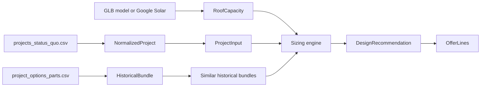

# Data Models

This document explains the data models used by the Renewable Design Studio prototype.

The app combines three sources of information:

1. Customer/project data from `projects_status_quo.csv`
2. Historical offer component data from `project_options_parts.csv`
3. Roof capacity data from either local GLB photogrammetry models or Google Solar API

The result is a renewable system design with PV, battery storage, heat pump, wallbox, and an editable offer summary.

## Data Flow



## Raw Customer Project

Source file:

```text
Project Data/*/projects_status_quo.csv
```

This file describes the customer's current situation before a new offer is created.

Important raw fields:

```ts
type RawProjectRow = {
  project_id: string
  customer_contact_id: string
  country: string

  energy_demand_wh: string
  energy_price_per_wh: string
  energy_price_increase: string
  energy_price_with_flexible_tariff: string

  load_profile: string

  has_ev: "True" | "False" | ""
  ev_annual_drive_distance_km: string

  has_solar: "True" | "False" | ""
  solar_size_kwp: string
  solar_angle: string
  solar_orientation: string

  has_storage: "True" | "False" | ""
  storage_size_kwh: string

  has_wallbox: "True" | "False" | ""
  wallbox_charge_speed_kw: string

  heating_existing_type: string
  heating_existing_cost_per_year: string
  heating_existing_electricity_demand_kwh: string
  heating_existing_heating_demand_wh: string

  house_size_sqm: string
  house_built_year: string
  num_inhabitants: string
}
```

## Normalized Project

Implemented in `normalizeProject` in `viewer.html`.

The app converts raw CSV strings into numeric fields and booleans.

```ts
type NormalizedProject = RawProjectRow & {
  energyDemandKwh: number | null
  priceEurKwh: number | null
  hasEvBool: boolean
  evKm: number | null
  hasStorageBool: boolean
  hasWallboxBool: boolean
  heatingType: string
  heatingCost: number | null
  heatingDemandKwh: number | null
  heatElectricKwh: number | null
  houseSize: number | null
  inhabitants: number | null
}
```

Key conversions:

```text
energy_demand_wh / 1000 -> energyDemandKwh
energy_price_per_wh * 1000 -> priceEurKwh
heating_existing_heating_demand_wh / 1000 -> heatingDemandKwh
"True" / "False" -> boolean
```

This normalized project is used for:

- filling the project input form
- finding similar historical projects
- deriving electricity and heating load
- deciding whether to include wallbox or heat pump by default

## Raw Offer Part

Source file:

```text
Project Data/*/project_options_parts.csv
```

This file describes line items that were actually planned or sold for historical project options.

Important raw fields:

```ts
type RawOfferPartRow = {
  project_id: string
  option_id: string
  option_number: string
  technology: "solar" | "ses" | "heatpump" | "wallbox" | string
  line_item_function: string
  component_type: string
  component_name: string
  component_brand: string
  quantity: string
  quantity_units: string
  module_watt_peak: string
  inverter_power_kw: string
  battery_capacity_kwh: string
  wb_charging_speed_kw: string
  heatpump_nominal_power_kw: string
}
```

Notes:

- `technology = "solar"` usually means PV-related lines.
- `technology = "ses"` means stationary energy storage.
- Quantities are sometimes actual component counts and sometimes package/service quantities.
- Some capacities are explicit columns, while others are inferred from `component_name`, such as `Battery 7kWh` or `Complete Package 10.8kWp`.

## Historical Bundle

Implemented in `buildBundles` in `viewer.html`.

The app groups offer parts by:

```text
project_id + option_id
```

Each group becomes one historical offer bundle.

```ts
type HistoricalBundle = {
  projectId: string
  optionId: string
  optionNumber: number
  technologies: string[]

  moduleCount: number
  moduleWatt: number
  pvKwp: number
  batteryKwh: number
  inverterKw: number
  wallboxKw: number
  heatpumpKw: number

  lines: {
    tech: string
    componentType: string
    componentName: string
    qty: number
  }[]
}
```

How values are inferred:

- `moduleCount` comes from median module-like quantities, such as substructure, roof mounting, optimizer, or explicit module rows.
- `moduleWatt` comes from `module_watt_peak`, defaulting to 430 W.
- `pvKwp` is `moduleCount * moduleWatt / 1000`, or inferred from package names when module count is missing.
- `batteryKwh` comes from `battery_capacity_kwh` or names like `Battery 7kWh`.
- `inverterKw`, `wallboxKw`, and `heatpumpKw` come from their explicit capacity columns where available.

This bundle is not a price model. It is used as a historical anchor for realistic sizing and component composition.

## Project Input

This is the current state of the installer form in the UI.

```ts
type ProjectInput = {
  annualDemandKwh: number
  priceEurKwh: number
  houseSize: number
  inhabitants: number

  hasEv: boolean
  evKm: number

  heatingType: string
  heatDemandKwh: number
  heatingCost: number

  roofSafety: number
}
```

Defaults are used when fields are missing:

- electricity demand: 4500 kWh/year
- electricity price: 0.39 EUR/kWh
- house size: 140 sqm
- inhabitants: 4
- EV distance: 15000 km/year when EV is enabled
- heat demand: estimated from house size when missing

## Similar Historical Match

Implemented in `findSimilarBundles` in `viewer.html`.

For a new customer input, the app scores historical projects by similarity.

```ts
type SimilarBundleMatch = {
  score: number
  project: NormalizedProject
  bundle: HistoricalBundle
}
```

Current scoring logic:

```text
demand difference / 1800
+ EV mismatch penalty
+ heating type mismatch penalty
+ house size difference / 120
```

The best matches are used to:

- nudge PV module count toward historically common sizes
- nudge battery size toward historically common sizes
- show a "Historical anchor" in the offer panel

## Roof Plane

Implemented in `makeRoofPlane` in `viewer.html`.

For local GLB models, the app samples mesh triangles and clusters likely roof surfaces.

```ts
type RoofPlane = {
  id: string

  normal: Vector3
  u: Vector3
  v: Vector3
  center: Vector3
  layoutCenter: Vector3

  width: number
  depth: number
  rawArea: number
  usableArea: number
  maxModules: number

  slope: number
  azimuth: number
  confidence: number
}
```

Meaning:

- `normal`: direction the roof plane faces
- `u` and `v`: local axes used to place module rectangles on the plane
- `rawArea`: sampled mesh area for the cluster
- `usableArea`: reduced area after margins and uncertainty
- `maxModules`: estimated number of PV modules that fit on the plane
- `slope`: pitch angle in degrees
- `azimuth`: rough orientation in degrees
- `confidence`: heuristic score for plane quality

## Local Roof Analysis

Implemented in `analyzeRoofGeometry` in `viewer.html`.

```ts
type RoofAnalysis = {
  box: Box3
  planes: RoofPlane[]
  usableArea: number
  rawMaxModules: number
  rawMaxKwp: number
  confidence: number
  sampledTriangles: number
  source: "Local GLB"
}
```

How the app extracts roof data from GLB models:

1. Traverse every mesh in the loaded GLB scene.
2. Sample triangles to keep the browser responsive.
3. Compute triangle normal, center, and area.
4. Keep upper surfaces that are likely roof candidates.
5. Cluster triangles by normal direction and height.
6. Estimate each roof plane's usable rectangle.
7. Calculate how many standard modules fit.

Standard module assumption:

```ts
const MODULE = {
  width: 1.134,
  height: 1.722,
  gap: 0.12,
  watt: 430
}
```

## Roof Capacity

Implemented in `getRoofCapacity` in `viewer.html`.

The sizing engine does not directly depend on GLB or Google data. It depends on a shared roof capacity shape.

```ts
type RoofCapacity = {
  source: "Local GLB" | "Google Solar" | "Fallback"
  maxModules: number
  rawMaxModules: number
  maxKwp: number
  usableArea: number
  planes: RoofPlane[]
  confidence: number
  panelWatts?: number
}
```

For local GLB:

```text
rawMaxModules * roofSafety -> maxModules
maxModules * 430 W -> maxKwp
```

For Google Solar:

```text
maxArrayPanelsCount -> maxModules
panelCapacityWatts -> panelWatts
roofSegmentStats -> planes
```

For fallback:

```text
28 modules, 430 W each
```

## Google Solar Data

Implemented in `fetchSolarApi` in `viewer.html`.

The Google Solar API path fetches `buildingInsights` for a latitude/longitude. The app extracts:

```ts
type GoogleSolarSubset = {
  solarPotential: {
    panelCapacityWatts?: number
    maxArrayPanelsCount?: number
    solarPanels?: unknown[]
    roofSegmentStats?: {
      pitchDegrees?: number
      azimuthDegrees?: number
      stats?: {
        areaMeters2?: number
      }
    }[]
  }
}
```

The app maps this into the same `RoofCapacity` model used by the local GLB path.

Google Solar is optional. Without an API key, the app still works using local GLB models.

## Design Recommendation

Implemented in `calculateDesign` in `viewer.html`.

This is the central output of the sizing engine.

```ts
type DesignRecommendation = {
  inputs: ProjectInput
  roof: RoofCapacity
  similar: SimilarBundleMatch[]
  selectedMatch: SimilarBundleMatch | null

  modules: number
  pvKwp: number
  batteryKwh: number
  inverterKw: number

  includeHeatpump: boolean
  heatpumpKw: number

  includeWallbox: boolean
  wallboxKw: number

  annualYield: number
  annualPvKwh: number
  totalElectricKwh: number
  selfConsumedKwh: number
  exportedKwh: number
  firstYearValue: number

  capReason: "roof limited" | "demand sized"
}
```

Core sizing logic:

```text
EV load = evKm * 0.18 kWh/km
heat pump electric load = heatDemandKwh / 3.5
total electric load = household load + EV load + heat pump electric load

target PV kWp = total electric load / annualYield
modules = ceil(target PV kWp / 0.43)
modules are capped by roof.maxModules
```

Battery logic:

```text
batteryKwh roughly follows pvKwp * 0.82
+ small EV bonus
+ blend with similar historical battery sizes
```

Heat pump logic:

```text
include by default for Gas, Oil, or OtherNonRenewable heating
heatpumpKw = heatDemandKwh / 1850
clamped between 5 and 16 kW
```

Wallbox logic:

```text
include by default when hasEv is true
wallboxKw = 11
```

First-year value logic:

```text
power savings = selfConsumedKwh * power price
feed-in value = exportedKwh * 0.08 EUR/kWh
heating savings = 62% of existing heating cost when heat pump is included
firstYearValue = power savings + feed-in value + heating savings
```

## Refinement State

The installer can override the recommendation.

```ts
type RefinementState = {
  mode: "economy" | "recommended" | "max"
  modules: number | null
  batteryKwh: number | null
  includeBattery: boolean
  includeHeatpump: boolean | null
  includeWallbox: boolean | null
}
```

Modes:

- `economy`: smaller PV and battery recommendation
- `recommended`: demand-sized and historically grounded
- `max`: fills the available roof capacity

Natural language refinement updates this same state. Example phrases:

- "make it cheaper" -> economy mode
- "fill the roof" -> max mode
- "remove heat pump" -> heat pump excluded
- "add backup storage" -> battery included and increased
- "24 panels" -> explicit module override

## Offer Lines

Implemented in `buildOfferLines` in `viewer.html`.

The offer model is intentionally simple for the prototype.

```ts
type OfferLine = [componentName: string, quantityLabel: string]
```

Example:

```ts
[
  ["PV modules", "14 x 430 W"],
  ["PV array size", "6.0 kWp"],
  ["Hybrid inverter", "5.2 kW"],
  ["Battery storage", "6.2 kWh"],
  ["Substructure and roof mounting", "14 module positions"],
  ["Electrical installation and grid registration", "1 package"]
]
```

Conditional lines:

- Battery storage appears only when battery is included.
- Heat pump appears only when heat pump is included.
- Wallbox appears only when wallbox is included.

## Current Implementation References

- Data loading: `viewer.html`, `loadProjectData`
- Customer normalization: `viewer.html`, `normalizeProject`
- Historical bundle extraction: `viewer.html`, `buildBundles`
- Similarity matching: `viewer.html`, `findSimilarBundles`
- Roof analysis: `viewer.html`, `analyzeRoofGeometry`
- Roof plane model: `viewer.html`, `makeRoofPlane`
- Sizing engine: `viewer.html`, `calculateDesign`
- Google Solar integration: `viewer.html`, `fetchSolarApi`
- Offer output: `viewer.html`, `buildOfferLines`

